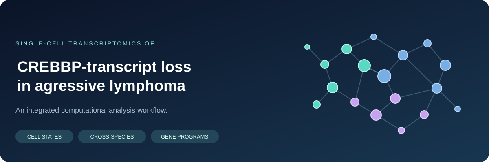
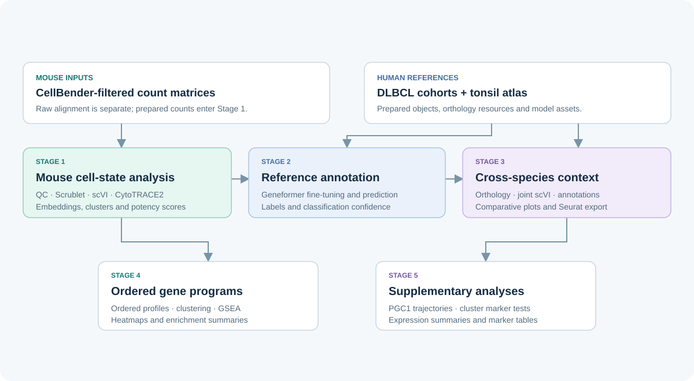

<p align="center">
  
</p>

# CREBBP Aggressive Lymphoma · Single-Cell Analysis

[](https://www.python.org/)
[](https://scanpy.readthedocs.io/)
[](https://scvi-tools.org/)
[](LICENSE)
[](MATHEMATICAL_METHODS.md)

This repository contains the computational analysis pipeline and mathematical modeling framework for single-cell transcriptomic dissection of aggressive B-cell lymphoma. The workflow investigates cellular heterogeneity, differentiation potency, and transcriptional dynamics in mouse models of *Crebbp*-deficient aggressive lymphoma and contextualizes malignant states against human Diffuse Large B-Cell Lymphoma (DLBCL) patient cohorts and the Human Tonsil Atlas.

---

## Table of Contents

- [Overview & Scientific Scope](#overview--scientific-scope)
- [Workflow Architecture](#workflow-architecture)
- [Repository Structure](#repository-structure)
- [System Requirements & Installation](#system-requirements--installation)
- [Quick Start & Verification](#quick-start--verification)
- [Pipeline Execution](#pipeline-execution)
- [Analysis-to-Code Mapping](#analysis-to-code-mapping)
- [Mathematical & Methodological Framework](#mathematical--methodological-framework)
- [Data Availability](#data-availability)
- [Citation & License](#citation--license)

---

## Overview & Scientific Scope

Aggressive lymphomas driven by *CREBBP* mutations or loss-of-function exhibit perturbed epigenetic regulation, altered developmental plasticity, and variable immune microenvironments. This pipeline integrates state-of-the-art single-cell machine learning and statistical modeling tools to address key biological questions:

| Research Theme | Computational Approach | Analytical Outputs |
| :--- | :--- | :--- |
| **Cellular Heterogeneity & QC** | CellBender ambient RNA decontamination, Scrublet doublet removal, and scVI deep generative modeling | Cleaned count matrices, 30-D latent manifold embeddings, Leiden cluster partitions |
| **Developmental Potency** | CytoTRACE2 transcriptional entropy and harmonic graph diffusion | Potency scores $[0, 1]$, continuous developmental rankings, differentiation status |
| **Germinal Center Annotation** | Geneformer fine-tuning on human tonsil reference atlases | Foundation model cell-type classification, prediction logits, confidence metrics |
| **Cross-Species Alignment** | Ensembl 1:1 orthology mapping and multi-covariate scVI integration | Joint human–mouse latent embeddings, shared trajectory alignment, Seurat v5 export |
| **Dynamic Gene Programs** | Dual-metric trajectory distance clustering, MAGIC diffusion imputation, and GSEA | Kinetic expression heatmaps, condition divergence ($\Delta r$), pathway enrichment |
| **Malignant State Validation** | Wilcoxon rank-sum testing with Benjamini-Hochberg FDR and PGC1 trajectory analysis | Differential expression tables, metabolic program shifts, volcano plots |

---

## Workflow Architecture

<p align="center">
  
</p>

The end-to-end analytical pipeline is structured into six modular stages:

| Stage | Focus | Primary Tools & Methods | Key Output Artifacts |
| :---: | :--- | :--- | :--- |
| **Stage 0** | **Upstream Processing** | 10x Genomics Cell Ranger (`count`), reference alignment | Filtered & raw feature-barcode matrices |
| **Stage 1** | **Mouse Cell States & Potency** | CellBender, Scanpy, scVI, CytoTRACE2 | Integrated mouse AnnData, UMAPs, potency scores |
| **Stage 2** | **Reference Model & Annotation** | Hugging Face Transformers, Geneformer | Fine-tuned tonsil model checkpoint, mouse cell predictions |
| **Stage 3** | **Cross-Species Integration** | Reciprocal orthology mapping, joint scVI, Seurat v5 | Cross-species AnnData, comparative UMAPs, Seurat `.rds` |
| **Stage 4** | **Expression Dynamics & GSEA** | Trajectory smoothing, dual-metric clustering, GSEApy | Kinetic heatmaps, program clusters, GSEA dotplots |
| **Stage 5** | **Marker Testing & Trajectories** | Wilcoxon rank-sum tests, BH-FDR correction, GAM curves | Marker gene tables, PGC1/metabolic trajectory plots |

---

## Repository Structure

```text
.
├── MasterAnalysis.sh              # Unified CLI pipeline orchestrator (--run, --stage, --dry-run)
├── MATHEMATICAL_METHODS.md        # Comprehensive mathematical specifications & model justifications
├── Makefile                       # One-command developer tasks (test, smoke-test, dry-run, lint)
├── banner.svg                     # Repository visual banner
├── workflow.svg                   # Pipeline architecture diagram
├── environment.yml                # Conda environment: Scanpy, scVI-tools, CytoTRACE2
├── environment_geneformer.yml     # Conda environment: Geneformer foundation model stack
├── requirements.txt               # Pinned pip dependencies
│
├── config/
│   ├── pipeline_config.yaml       # Hyperparameters, QC thresholds, and modeling parameters
│   └── README.md                  # Configuration guide
│
├── data/
│   └── DATA_MANIFEST.md           # Dataset manifests, GEO accessions, and reference sources
│
├── scripts/                       # 26 analysis scripts + 1 synthetic smoke test
│   ├── cellranger_shabanas_gex.sh
│   ├── convert_human_mouse_integration_to_seurat5.R
│   ├── cytotrace2_dlbcl_mouse_tonsil.py
│   ├── downstream_plots_human_mouse_integration.py
│   ├── geneformer_predict_and_plot_manuscript.py
│   ├── geneformer_predict_dlbcl_mouse_tonsil.py
│   ├── generate_public_gene_set_scores_mouse.py
│   ├── gsea_umap_ppargc1a_A.py
│   ├── gsea_umap_ppargc1a_B.py
│   ├── mouse_scvi_cytotrace2_cellbender.py
│   ├── ordering_cytotrace_2_mouse_geneformer.py
│   ├── pgc1_cytotrace2_trajectory.py
│   ├── plot_cytotrace2_downstream.py
│   ├── plot_cytotrace2_on_scvi_umap.py
│   ├── plot_cytotrace2_stratified_by_tonsil_subtype.py
│   ├── plot_gsea_custom.py
│   ├── plot_gsea_custom_B.py
│   ├── plot_individual_samples_umap.py
│   ├── plot_umap_confidence.py
│   ├── plot_umap_highlight_clusters_4_6.py
│   ├── plot_umap_highlight_mouse_clusters_4_6.py
│   ├── plot_umap_leiden_majority_confidence.py
│   ├── plot_umap_leiden_majority_confidence_by_condition.py
│   ├── run_smoke_test.py
│   ├── scvi_human_dlbcl_mouse_malignant_integration.py
│   ├── train_geneformer_tonsil_multi.py
│   └── wilcoxon_rank_mouse_integrated.py
│
└── tests/
    └── test_pipeline_unit.py      # Unit test suite for QC, distances, correlations, and statistics
```

---

## System Requirements & Installation

### Hardware Requirements
- **Standard single-cell analysis**: 32 GB RAM, 8+ CPU cores.
- **Deep generative modeling (scVI)**: NVIDIA GPU with CUDA 11.8+ / 12.x and $\ge 8$ GB VRAM recommended.
- **Foundation model training (Geneformer)**: NVIDIA GPU with $\ge 16$ GB VRAM (e.g., A10G, A100, V100).

### Environment Setup

The pipeline utilizes two specialized Conda environments to ensure dependency isolation:

```bash
# 1. Clone the repository
git clone https://github.com/js2920/CREBBP_aggressive_lymphoma_single_cell.git
cd CREBBP_aggressive_lymphoma_single_cell

# 2. Build the primary single-cell environment (Scanpy, scVI, CytoTRACE2)
conda env create -f environment.yml
conda activate crebbp_sc_pipeline

# 3. (Optional) Build the Geneformer foundation model environment
conda env create -f environment_geneformer.yml
```

---

## Quick Start & Verification

To verify that the computational environment, numerical routines, and analytical workflows are functioning properly without requiring study datasets:

```bash
# Activate the pipeline environment
conda activate crebbp_sc_pipeline

# 1. Run unit test suite (QC calculations, distance metrics, rank correlations, BH-FDR)
make test

# 2. Run end-to-end synthetic smoke test (generates mock counts, runs QC -> Leiden -> DE in <5s)
make smoke-test

# 3. Perform a pipeline dry-run to inspect execution commands
make dry-run
```

Expected output for the smoke test:
```text
=================================================================
  CREBBP Single-Cell Pipeline Smoke Test (Synthetic Dataset)
=================================================================
  ✓ Scanpy and AnnData imported successfully
  ✓ Created synthetic dataset: 200 cells × 80 genes
  ✓ QC filter complete: 200 cells retained
  ✓ Leiden clustering identified 2 clusters
  ✓ Potency scoring calculated (mean: 0.506)
  ✓ Wilcoxon differential expression test complete
  ✓ Output successfully written to tmp/smoke_test_output/
=================================================================
  Smoke test PASSED successfully!
=================================================================
```

---

## Pipeline Execution

The pipeline is orchestrated via `MasterAnalysis.sh`, which supports targeted stage execution, dry-runs, and environment verification.

```bash
# View CLI options and stage descriptions
bash MasterAnalysis.sh --help

# Verify dependencies in current environment
bash MasterAnalysis.sh --check-env

# Preview execution plan without running
bash MasterAnalysis.sh --dry-run

# Run a specific analysis stage
bash MasterAnalysis.sh --run --stage 1    # Mouse scVI & CytoTRACE2 analysis
bash MasterAnalysis.sh --run --stage 3    # Cross-species human–mouse integration
bash MasterAnalysis.sh --run --stage 4    # Trajectory gene program clustering

# Run the complete end-to-end analysis
bash MasterAnalysis.sh --run
```

Alternatively, individual Python and R scripts located in `scripts/` can be executed independently.

---

## Analysis-to-Code Mapping

Every major analytical component maps to modular executable scripts:

| Analysis Module | Primary Script | Description |
| :--- | :--- | :--- |
| **Mouse Integration & Potency** | [`scripts/mouse_scvi_cytotrace2_cellbender.py`](scripts/mouse_scvi_cytotrace2_cellbender.py) | Ingests CellBender counts, performs QC, trains scVI VAE model, computes CytoTRACE2 potency scores |
| **Potency Visualization** | [`scripts/plot_cytotrace2_downstream.py`](scripts/plot_cytotrace2_downstream.py) | Generates multi-panel potency distributions, UMAP overlays, and condition stratification plots |
| **Tonsil Reference Training** | [`scripts/train_geneformer_tonsil_multi.py`](scripts/train_geneformer_tonsil_multi.py) | Fine-tunes pre-trained Geneformer 6-layer transformer on Human Tonsil Atlas GC B-cell subsets |
| **Foundation Model Inference** | [`scripts/geneformer_predict_and_plot_manuscript.py`](scripts/geneformer_predict_and_plot_manuscript.py) | Predicts GC cell-state probabilities for mouse lymphoma cells and evaluates classification margins |
| **Cross-Species Integration** | [`scripts/scvi_human_dlbcl_mouse_malignant_integration.py`](scripts/scvi_human_dlbcl_mouse_malignant_integration.py) | Computes 1:1 orthologs, aligns mouse malignant cells with human DLBCL & tonsils using joint scVI |
| **Joint Potency Scoring** | [`scripts/cytotrace2_dlbcl_mouse_tonsil.py`](scripts/cytotrace2_dlbcl_mouse_tonsil.py) | Evaluates differentiation potency across the unified cross-species manifold |
| **Dynamic Gene Programs** | [`scripts/ordering_cytotrace_2_mouse_geneformer.py`](scripts/ordering_cytotrace_2_mouse_geneformer.py) | Discovers co-regulated gene modules along potency trajectories via dual-metric clustering |
| **Custom Pathway GSEA** | [`scripts/plot_gsea_custom.py`](scripts/plot_gsea_custom.py) | Evaluates enriched Hallmark and Reactome pathways across kinetic modules |
| **Metabolic Trajectories** | [`scripts/pgc1_cytotrace2_trajectory.py`](scripts/pgc1_cytotrace2_trajectory.py) | Models PGC1/Ppargc1a expression dynamics and metabolic shifts across developmental orderings |
| **Differential Expression** | [`scripts/wilcoxon_rank_mouse_integrated.py`](scripts/wilcoxon_rank_mouse_integrated.py) | Non-parametric Wilcoxon rank-sum testing with Benjamini-Hochberg FDR across clusters |
| **Seurat Export** | [`scripts/convert_human_mouse_integration_to_seurat5.R`](scripts/convert_human_mouse_integration_to_seurat5.R) | Exports integrated AnnData objects into Seurat v5 format with multi-layer assays |

---

## Mathematical & Methodological Framework

The theoretical foundations, distributional assumptions, and inference procedures underlying this pipeline are comprehensively documented in [**`MATHEMATICAL_METHODS.md`**](MATHEMATICAL_METHODS.md).

| Modeling Domain | Methodological Approach | Key Theoretical Principle |
| :--- | :--- | :--- |
| **Count Modeling & Integration** | scVI (Variational Autoencoder) | Negative binomial generative modeling with amortized variational inference, decoupling technical library size and batch covariates from biological manifold coordinates. |
| **Differentiation Potency** | CytoTRACE2 | Harmonic graph diffusion over single-cell affinity graphs, modeling developmental commitment as progressive restriction of transcriptional entropy. |
| **Contextual Cell Typing** | Geneformer | Rank-value attention encoding in transformer latent space, with epistemic uncertainty quantified by Shannon classification entropy across GC subsets. |
| **Kinetic Trajectory Programs** | Dual-Metric Trajectory Clustering | Combined distance metric unifying temporal profile shape (Pearson correlation) with absolute expression amplitude scaling. |
| **Statistical Testing** | Wilcoxon Rank-Sum & GSEA | Non-parametric rank-sum testing with Benjamini–Hochberg false discovery rate (FDR) control and phenotype-permuted Kolmogorov–Smirnov enrichment. |

For complete derivations, loss functions, variational inference objectives, and empirical justifications, refer to [**`MATHEMATICAL_METHODS.md`**](MATHEMATICAL_METHODS.md).

---

## Data Availability

A complete guide to dataset accessions, reference genome builds, and file structures is provided in [**`data/DATA_MANIFEST.md`**](data/DATA_MANIFEST.md).

- **Primary Study Data**: Mouse single-cell RNA-seq count matrices from *Crebbp*-deficient aggressive B-cell lymphomas are accessible via NCBI GEO under accession **GSE332767**.
- **Human Reference Data**:
  - Human DLBCL single-cell RNA-seq cohorts (Roider et al.; Steen et al., GSE182434).
  - Human Tonsil Atlas germinal center B-cell single-cell reference data (`HCATonsilData`).
- **Genomic References**: Mouse GRCm38 / mm10 and Human GRCh38 / hg38 reference transcriptomes.


### License
This project is licensed under the **MIT License** — see the [LICENSE](LICENSE) file for details. Associated third-party datasets, packages, and model weights retain their respective open-source licenses.
